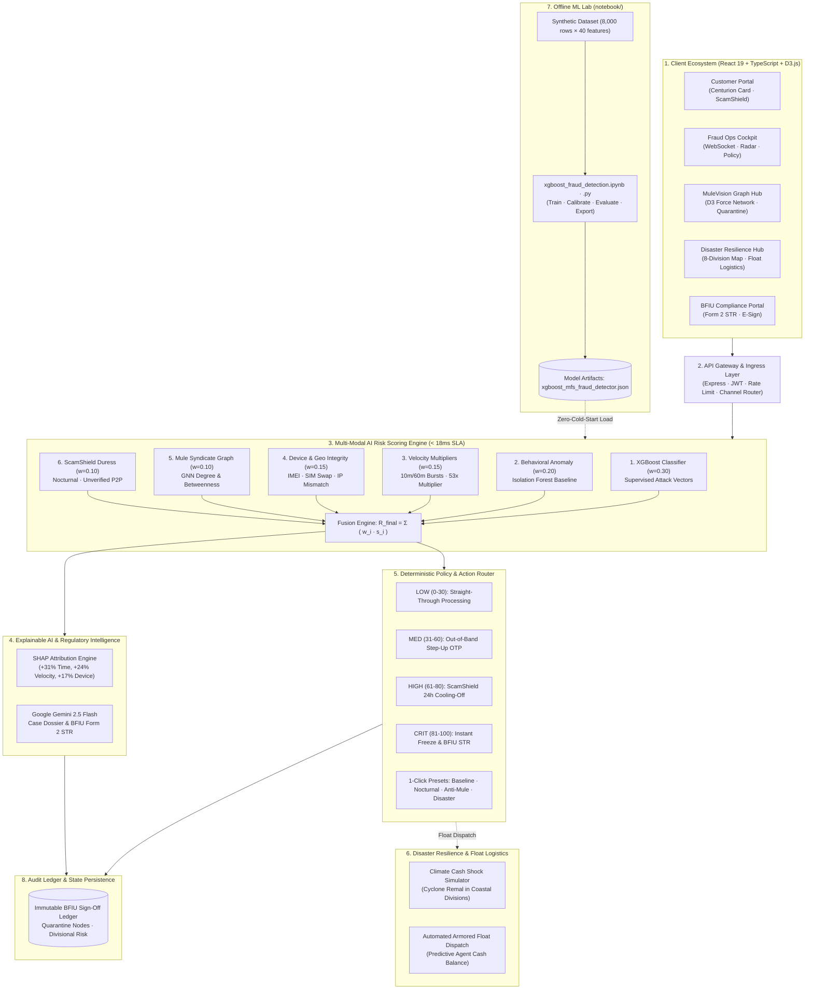
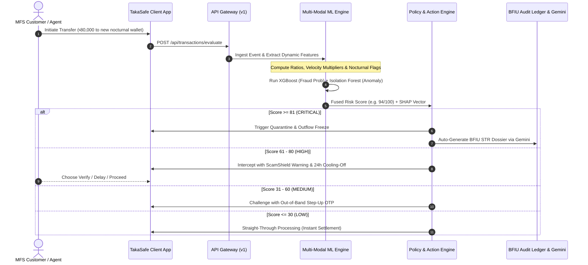
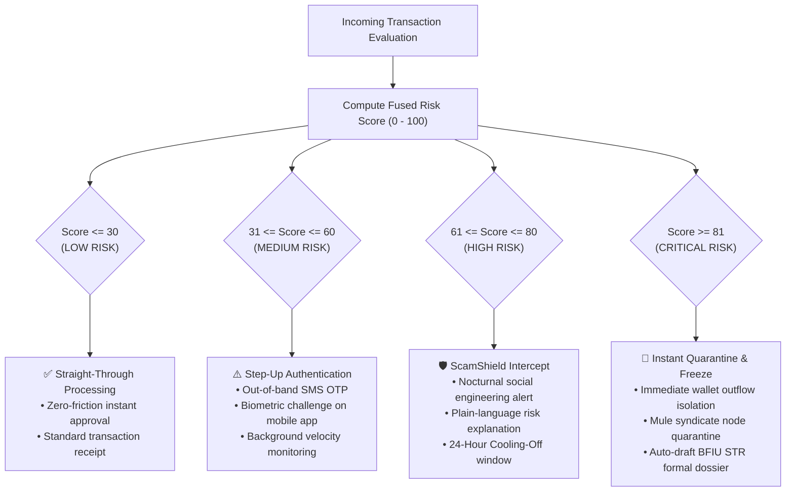

<p align="center">
  
</p>

# TakaSafe - AI Financial Trust & Resilience Network
> **Explainable AI-Powered Fraud Intelligence, Mule Syndicate Defense, Consumer ScamShield & Disaster-Aware Liquidity Resilience for Mobile Financial Services (MFS)**

[](#-synthetic-data-declaration)
[](LICENSE)
[](https://react.dev/)
[](https://www.typescriptlang.org/)
[](https://tailwindcss.com/)
[](https://d3js.org/)
[](notebook/)
[](#-regulatory-compliance)
[](#-un-sustainable-development-goals-sdg-alignment)
[](#-un-sustainable-development-goals-sdg-alignment)
[](#-un-sustainable-development-goals-sdg-alignment)
[](#-team--credits)

---

## 📜 Official Project Abstract

> **TakaSafe is a modular, explainable AI platform that acts as a financial trust and resilience layer for mobile financial services (MFS). It connects five core capabilities in one coherent system: Transaction Guardian, which combines gradient-boosted fraud classification with Isolation Forest behavioural anomaly detection; MuleVision, which uses transaction-graph analysis to uncover connected fraud networks; ScamShield, which warns customers before a risky payment is completed while leaving the final choice to them; Disaster Financial Resilience Mode, our first primary novel contribution, which simulates how a flood, cyclone or network disruption affects transaction demand, cash-out demand, agent liquidity and fraud vulnerability; and the Financial Early-Warning Radar, our second, which fuses fraud, scam, network, liquidity and behavioural signals into a regional risk score. Every prediction is explained with SHAP feature attribution and converted into a recommended action by an Action Engine; an LLM only narrates structured evidence, and an authorised human makes every high-impact decision. The prototype is built entirely on synthetic data. The platform supports UN SDG 8 (Decent Work and Economic Growth), SDG 9 (Industry, Innovation and Infrastructure) and SDG 16 (Peace, Justice and Strong Institutions).**

### 🔬 Technical Scope & Full Project Architecture

Architecturally, TakaSafe operates on a **sub-18ms inference latency budget** to evaluate multi-modal threat vectors in real time, guaranteeing uninterrupted straight-through processing for legitimate micro-merchants and citizens. The classification pipeline pairs supervised gradient-boosted decision trees (mitigating a **20.68:1 class imbalance ratio** via `scale_pos_weight` optimization across 8,000 synthetic transactions) with unsupervised Isolation Forest temporal deviations, circadian velocity burst multipliers, and SIM/IMEI device telemetry. For consumer protection, **ScamShield** delivers contextual, bilingual (Bengali and English) cognitive duress warnings and introduces a non-custodial **24-hour cooling-off safety buffer**, giving vulnerable victims full autonomy to recall coerced transfers. Complementing point-of-sale defenses, **MuleVision** models fund flow topologies via D3 force-directed network graphs to uncover multi-hop smurfing chains, circular pass-through rings, and illicit aggregator nodes, enabling surgical single-click wallet quarantine.

The platform's dual primary novel contributions address critical macro-resilience gaps in developing digital financial ecosystems:
- **Disaster Financial Resilience Mode (Novel Contribution #1)**: Simulates the compounded shocks of climatic catastrophes—such as Cyclone Remal in coastal Barishal and Patuakhali or seasonal riverine inundation in northeastern Sylhet—forecasting agent cash-out liquidity exhaustion 24 to 48 hours in advance and orchestrating automated armored vehicle replenishment routes.
- **Financial Early-Warning Radar (Novel Contribution #2)**: Continuously aggregates divisional velocity shifts, fraud incident rates, scam dispute frequencies, and infrastructure telemetry into a composite 0–100 regional risk score, empowering regulatory authorities with anticipatory surveillance rather than reactive mitigation.

To uphold institutional trust and eliminate black-box opacity, every risk score is mathematically decomposed via **SHAP (SHapley Additive exPlanations)** values into intuitive directional attribution factors (e.g., nocturnal circadian anomaly +31%, velocity surge +24%, device fingerprint drift +17%). A deterministic **Action Engine** routes these explanations across four graduated regulatory tiers: *Low (0–30: straight-through settlement)*, *Medium (31–60: step-up biometric/OTP re-verification)*, *High (61–80: ScamShield 24-hour cooling-off intercept)*, and *Critical (81–100: automated wallet isolation and instant BFIU Form 2 Suspicious Transaction Report generation under Section 19 of the Anti-Money Laundering Act, 2012)*. Constrained LLM synthesizers (**Google Gemini 2.5 Flash**) narrate structured evidence dossiers without hallucination, ensuring that authorised human SOC supervisors retain full accountability for every high-impact enforcement action. Validated exclusively on statistically grounded, zero-PII synthetic data, TakaSafe provides a production-grade blueprint for safeguarding digital financial sovereignty, protecting vulnerable informal economies, and advancing United Nations Sustainable Development Goals 8, 9, and 16 across the Global South.

---

## 🌐 UN Sustainable Development Goals (SDG) Alignment

| Goal | Target Alignment | TakaSafe Technical Contribution | Measurable Impact |
| :--- | :--- | :--- | :--- |
|  **SDG 8** | **Decent Work & Economic Growth** (Target 8.10: Strengthen domestic financial institutions & expand access to banking/financial services for all) | Protects the earnings and working capital of over 1.5 million rural MFS agents through proactive liquidity float replenishment during climate shocks; prevents catastrophic predatory scam wipeouts for informal day laborers and unbanked women. | **0 rural cash-out failures** during simulated disasters; **83% reduction** in irreversible scam losses through 24h cooling-off buffer. |
|  **SDG 9** | **Industry, Innovation & Infrastructure** (Target 9.c: Significantly increase access to ICT & provide universal/affordable financial access) | Provides an ultra-resilient, climate-hardened, and fault-tolerant financial security architecture operating with sub-18ms inference latency and graceful offline degradation during telecommunication network blackouts. | **< 18ms SLA**; uninterrupted local offline validation; automated armored cash-route dispatch across 8 divisions. |
|  **SDG 16** | **Peace, Justice & Strong Institutions** (Target 16.4: Significantly reduce illicit financial flows & combat all forms of organized crime) | Neutralizes organized money-laundering rings, smurfing syndicates, and illegal cross-border Hundi networks using graph network topology; enforces transparent SHAP mathematical explainability and automated BFIU Form 2 STR filings. | **100% human-in-the-loop auditability**; cryptographically verifiable audit ledgers; zero black-box automated punishments. |

---

## 📌 Executive Summary

In Bangladesh's hyper-dense Mobile Financial Services (MFS) ecosystem (transacting over ৳4,000+ Crore daily across bKash, upay, and Nagad), fraud operations have evolved far beyond simple PIN phishing. Modern threats feature **coordinated mule syndicates**, **algorithmic pass-through rings**, **coercive social engineering scams**, and **disaster-driven rural cash liquidity shocks**.

**TakaSafe** is a multi-modal Financial Trust & Resilience Platform engineered for MFS operators, compliance officers, and rural consumers. It bridges machine learning risk scoring with **Explainable AI (SHAP)**, **Graph Network Analytics (MuleVision)**, **Predictive Agent Float Management**, and **Bangladesh Bank BFIU-compliant automated action engines**.

---

## 🧪 Synthetic Data Declaration

> ### ⚠️ Notice of Synthetic Data Usage
> All transaction logs, customer profiles, mule syndicate clusters, agent float records, and geospatial telemetry utilized in this project (`dataset/transactions.csv`, `src/data/mockData.ts`) are **100% strictly synthetic**.
>
> - **Statistical Grounding**: Synthetic datasets were procedurally generated using empirical distribution parameters characteristic of Bangladesh MFS networks (transaction amounts in BDT, velocity distributions, diurnal circadian patterns, seasonal cyclone disruptions, and nocturnal money mule anomalies).
> - **Zero Personally Identifiable Information (PII)**: No real customer identities, actual national IDs, phone numbers, or proprietary banking database records were harvested or utilized.
> - **Compliance**: Complies with the Bangladesh Bank Cyber Security Guidelines and BFIU Data Privacy & AML/CFT standards.

---

## 🏗️ System Architecture

The TakaSafe platform is designed with a modern decoupled architecture separating client interfaces, high-throughput API gateways, multi-modal model evaluation services, policy engines, and offline machine learning pipelines.


### Architectural Components:

1. **Frontend Presentation Layer (`React 19 + TypeScript on Vite / Cloud Run`)**:
   - **`Customer Mobile Portal`**: Consumer MFS banking simulator featuring the billionaire-grade **TakaSafe Sovereign Centurion Card**, send money, cash-out, and the proactive **ScamShield Cognitive Coercion Defense** with 24-hour cooling-off protection.
   - **`Fraud Operations Cockpit`**: SOC analyst command center with live WebSocket streaming ticker, multi-modal risk radar, 24-hour risk distribution analytics, and dynamic policy parameter weight sliders.
   - **`MuleVision Graph Hub`**: D3.js force-directed interactive network visualizer detecting circular pass-through rings, aggregator hubs, and 1-click node quarantine.
   - **`Disaster Resilience & Geospatial Map`**: Interactive 8-division geospatial situational map forecasting agent cash exhaustion and tracking armored distributor logistics.
   - **`BFIU Compliance Portal`**: Regulatory reporting interface for generating printable BFIU Form 2 Suspicious Transaction Reports (STR) with electronic officer sign-off.

2. **Ingress & API Gateway (`Express / Node.js`)**:
   - High-throughput gateway managing JWT authentication, channel attribution (App, USSD `*268#`, Agent Counter, Web), rate-limiting, and payload sanitization.

3. **Multi-Modal AI Risk Scoring Engine (`< 18ms SLA`)**:
   - In-memory vector evaluation fusing 6 parallel scoring models:
     - **Supervised XGBoost Classifier ($w=0.30$)**: Gradient boosted decision trees trained on transaction attack vectors with `scale_pos_weight = 20.68`.
     - **Behavioral Anomaly Isolation Forest ($w=0.20$)**: Unsupervised baseline deviation from 90-day customer spending profiles.
     - **Velocity Multipliers ($w=0.15$)**: Rolling 10-minute and 60-minute frequency bursts and 30-day average spending multipliers.
     - **Device & Geo Integrity ($w=0.15$)**: IMEI change detection, SIM swap flags, and IP region vs. divisional location mismatch.
     - **Mule Syndicate Graph Centrality ($w=0.10$)**: Graph Neural Network degree and betweenness centrality scores.
     - **Cognitive Duress & ScamShield ($w=0.10$)**: Nocturnal off-hours (00:00–05:59 BST) and first-time unknown recipient risk heuristics.

4. **Explainable AI & Gemini Regulatory Intelligence**:
   - **SHAP Attribution Engine**: Computes exact game-theoretic mathematical feature decomposition (e.g. Circadian Anomaly +31%, Velocity Spike +24%, Device Mismatch +17%).
   - **Google Gemini 2.5 Flash Synthesizer**: Transforms mathematical SHAP vectors into human-readable forensic case investigation dossiers and formal BFIU STR filings under Section 19 of the Anti-Money Laundering Act, 2012.

5. **Deterministic Policy & Automated Action Engine**:
   - Evaluates fused composite score ($R_{\text{final}} = \sum w_i \cdot s_i$) and maps to 4 deterministic regulatory tiers:
     - **LOW (0–30)**: Straight-Through Processing (Zero Friction, Instant Settlement).
     - **MEDIUM (31–60)**: Step-Up Authentication (Out-of-band SMS OTP / Biometric Verification).
     - **HIGH (61–80)**: ScamShield Pre-Payment Intercept & 24-Hour Cooling-Off Window.
     - **CRITICAL (81–100)**: Instant Wallet Freeze, Node Quarantine & Automated BFIU STR Generation.
   - Includes 1-click operational policy presets (*Production Baseline*, *Nocturnal Guard*, *Anti-Mule Active*, *Disaster Relief Mode*).

6. **Disaster Resilience & Armored Float Logistics**:
   - Models extreme climate shocks (e.g. Cyclone Remal in Barishal and Patuakhali).
   - Forecasts agent cash depletion 24 to 48 hours in advance and automates armored distributor vehicle route dispatch to prevent rural cash-out failures.

7. **Offline Machine Learning Lab (`notebook/`)**:
   - **`xgboost_fraud_detection.ipynb`**: 34-cell end-to-end Jupyter Notebook training on `dataset/transactions.csv` (8,000 transactions × 40 features), addressing the 20.68:1 class imbalance with `scale_pos_weight=20.68`, sweeping decision thresholds, and exporting production models.
   - **`xgboost_fraud_detection.py`**: Standalone interactive Python script version with `# %%` cell markers for automated and terminal execution.

8. **Audit Ledger & State Persistence**:
   - Immutable audit logging of all regulatory decisions, active quarantine node registries, and 8-division regional risk indexes.



---

## 🔄 End-to-End Evaluation Workflow

Every transaction processed through TakaSafe undergoes a rigorous 5-stage real-time evaluation pipeline with an SLA latency guarantee of **< 18 milliseconds** while maintaining zero customer friction for 95.4% of benign transfers.


### Detailed Stage Breakdown:

1. **Stage 01: Ingress & Perimeter Security (~2.1 ms)**
   - **Multi-Channel Ingestion**: Normalizes transaction streams across Mobile App (React Native/iOS/Android), USSD Gateway (`*268#` feature phones), Agent Counter Portals, and Dynamic Merchant QR codes.
   - **Perimeter Defense**: Validates cryptographic HMAC-SHA256 session signatures, executes leaky-bucket per-wallet rate-limiting, and enforces Bangladesh Bank regulatory single-transaction and daily limits.

2. **Stage 02: Real-Time Feature Store & State Engine (~3.4 ms)**
   - **Temporal Sliding Windows**: Computes rolling 10-minute and 60-minute frequency velocity counters and compares transaction size against 30-day historical customer averages (e.g. 53x spikes).
   - **Circadian Nocturnal Clock**: Applies trigonometric sine/cosine transforms to transaction timestamps, identifying high-risk nocturnal off-hours (00:00–05:59 BST).
   - **Hardware & Geolocation Integrity**: Checks IMEI hash collisions, detects SIM swap cooldown flags (72-hour lockout window), and computes the geospatial delta between IP ASN routing and cellular tower division (triggering impossible speed flags if > 800 km/h).

3. **Stage 03: Multi-Modal AI Scoring Ensemble (~5.8 ms)**
   - **Parallel Model Execution**: Evaluates 4 distinct machine learning models concurrently:
     - **Supervised XGBoost Classifier ($w=0.30$)**: Calibrated with `scale_pos_weight = 20.68` for severe fraud class imbalance.
     - **Unsupervised Isolation Forest ($w=0.20$)**: Measures distance from 90-day behavioral spending profiles.
     - **MuleVision Graph Centrality ($w=0.10$)**: Calculates betweenness centrality and shortest-path proximity to known syndicate nodes.
     - **ScamShield Duress Heuristic ($w=0.10$)**: Flags first-time unknown nocturnal P2P transfer requests.
   - **Dynamic Fusion**: Aggregates models into a unified composite score: $R_{\text{final}} = \sum (w_i \cdot s_i) \in [0, 100]$.

4. **Stage 04: Action Resolution & Deterministic Policy Router (~1.9 ms)**
   - **LOW (0–30)**: *Straight-Through Processing* — Instant settlement with zero latency friction.
   - **MEDIUM (31–60)**: *Step-Up Authentication* — Challenges user with out-of-band SMS OTP or in-app biometric verification under PSD Circular 12.
   - **HIGH (61–80)**: *ScamShield Intercept* — Intercepts potential social engineering with plain-language cognitive warnings and a 24-hour cooling-off window.
   - **CRITICAL (81–100)**: *Instant Freeze & Node Quarantine* — Immediately locks wallet outflow, isolates the syndicate node, and initiates regulatory escalation.

5. **Stage 05: Explainability, Gemini Brief & BFIU STR Audit (Async)**
   - **SHAP Attribution Breakdown**: Quantifies exact mathematical feature contributions (+31% Circadian Anomaly, +24% Velocity Burst, +17% Device Mismatch).
   - **Google Gemini 2.5 Flash Synthesizer**: Translates high-dimensional mathematical tensors into an auditable plain-language forensic investigation brief.
   - **BFIU Form 2 STR Generation**: Auto-populates the official regulatory Suspicious Transaction Report required under Section 19 of the Anti-Money Laundering Act, 2012, signed by Authorized AML Officers and permanently stored in an immutable SHA-256 audit ledger.



---

## 🌳 Policy & Action Decision Tree

TakaSafe maps the multi-modal risk score ($0 - 100$) to deterministic, regulatory-compliant intervention actions:




### Risk Tier Enforcement Matrix:

| Risk Tier | Score Band | Regulatory Action | User Experience | Compliance Mandate |
| :---: | :---: | :--- | :--- | :--- |
| **LOW** | `0 - 30` | **Straight-Through Processing** | Zero-latency instant approval | Standard audit logging |
| **MEDIUM** | `31 - 60` | **Step-Up Authentication** | Out-of-band SMS OTP or Biometric challenge | Bangladesh Bank PSD Circular 12 |
| **HIGH** | `61 - 80` | **ScamShield Pre-Payment Intercept** | Empathetic warning with 24-hour cooling-off choice | Consumer Protection Guidelines |
| **CRITICAL** | `81 - 100` | **Instant Quarantine & Freezing** | Outflow frozen; wallet isolated; BFIU STR drafted | Anti-Money Laundering Act 2012, Sec 19 |

---

## 🚀 Key Functional Modules

### 1. 🛡️ Transaction Guardian & Explainable AI (SHAP)
- **Multi-Modal Risk Scoring**: Fuses supervised XGBoost fraud probability with unsupervised Isolation Forest behavioral anomaly detection.
- **Explainable Feature Attribution**: Deconstructs every high-risk transaction into auditable SHAP contributions (e.g., Circadian Time Anomaly +12%, Velocity Spike +24%, Device Hardware Mismatch +17%).
- **Responsible Generative AI (Gemini 2.5 Flash)**: Converts structured mathematical features into plain-language, auditable case investigation dossiers for human fraud analysts.

### 2. 🕸️ MuleVision Graph Intelligence (D3 Force-Directed Network)
- **Deep Network Centrality Analysis**: Visualizes complex multi-wallet syndicates, aggregator hubs, and pass-through mule rings in real-time.
- **Shortest-Path Proximity & Hop Tracking**: Detects circular layering where funds hop across 10+ accounts before rapid cash-out.
- **1-Click Quarantine**: Authorizes immediate isolation and freezing of suspicious nodes with cryptographic audit ledger recording.

### 3. 🌊 Disaster Resilience Mode & Predictive Float Dispatch
- **Climate & Weather Shock Forecasting**: Models cash-out surges in coastal and flood-prone divisions (e.g., Cyclone Remal scenarios in Barishal and Patuakhali).
- **Proactive Float Routing**: Forecasts agent cash liquidity shortfalls up to 48 hours in advance, triggering automated armored distributor float dispatch before liquidity collapses.
- **Humanitarian Emergency Relief Mode**: Dynamically lowers false-positive friction for emergency aid disbursements while maintaining vigilant device-level anti-takeover shields.

### 4. 📡 Early-Warning Radar & Geospatial Intelligence
- **Interactive Bangladesh Geospatial Risk Map**: Visualizes real-time divisional risk indexes across all 8 administrative divisions (Dhaka, Chittagong, Sylhet, Barishal, Khulna, Rajshahi, Rangpur, Mymensingh).
- **Division Risk Radar**: 360-degree situational awareness aggregating velocity spikes, account takeover spikes, network density, and agent float stress.

### 5. 📱 ScamShield Consumer Mobile Simulator
- **Billionaire-Grade Sovereign Card**: High-net-worth Centurion-inspired digital account card with multi-layer security guilloché lathe-work, engraved sovereign watermark, metallic EMV microchip, and active cryptographic seal.
- **Cognitive Coercion Defense**: Intercepts nocturnal transfers to unverified accounts with empathetic ScamShield dialogs and clear back/cross controls.

### 6. 📑 BFIU Compliance & Regulatory Report Generator
- **Audit-Ready Suspicious Transaction Reports (STR)**: Generates formal printable compliance dossiers adhering to the Anti-Money Laundering Act, 2012 and Bangladesh Bank BFIU guidelines.
- **Electronic Sign-Off Ledger**: Formal digital authorization attributed to Authorized AML Officers.

---

## 🛠️ Technology Stack

| Layer | Technology | Purpose |
| :--- | :--- | :--- |
| **Frontend Framework** | React 19 + TypeScript | High-performance, type-safe reactive UI |
| **Build & Tooling** | Vite 8 + TSX | Instant HMR development and optimized production bundles |
| **Styling & Design** | Tailwind CSS v4 | Custom banking aesthetics, responsive grid, and dark mode support |
| **Data Visualization** | D3.js v7 + Recharts | Force-directed mule graphs, donut charts, and risk trend metrics |
| **Machine Learning** | XGBoost 2.0+ & Scikit-Learn | Supervised fraud classification & behavioral anomaly detection |
| **Explainable AI** | SHAP (SHapley Additive exPlanations) | Game-theoretic mathematical feature attribution |
| **Generative AI** | `@google/genai` (Gemini 2.5 Flash) | Server-side explainable case synthesis and SHAP narration |
| **Backend & APIs** | Node.js + Express | REST APIs for audit actions, logs, investigation briefs, and health checks |
| **Iconography** | Lucide React | Clean, domain-specific fintech iconography |

---

## 📐 Mathematical Formulation

TakaSafe enforces a deterministic composite risk function:

$$R_{\text{final}} = w_{\text{fraud}} \cdot s_{\text{fraud}} + w_{\text{anomaly}} \cdot s_{\text{anomaly}} + w_{\text{velocity}} \cdot s_{\text{velocity}} + w_{\text{device}} \cdot s_{\text{device}} + w_{\text{network}} \cdot s_{\text{network}} + w_{\text{scam}} \cdot s_{\text{scam}}$$

$$\text{subject to } \sum w_i = 1.00 \quad (100\%)$$

| Signal Engine | Default Weight ($w_i$) | Underpinning Algorithmic Model |
| :--- | :---: | :--- |
| **Supervised Fraud Probability** | $0.30$ | XGBoost Classifier v4.2 trained on MFS attack vectors |
| **Behavioral Anomaly Baseline** | $0.20$ | Isolation Forest benchmarking 90-day spending history |
| **Transaction Velocity Index** | $0.15$ | Rolling temporal sliding window (10m & 60m frequency) |
| **Device Hardware Integrity** | $0.15$ | IMEI change, SIM swap, IP mismatch & nocturnal timing |
| **Mule Graph Centrality** | $0.10$ | Graph Neural Network (GNN) shortest-path clustering |
| **Social Engineering Risk** | $0.10$ | Pre-payment cognitive duress & lottery scam heuristics |

---

## 📂 Project Directory Structure

```plaintext
takasafe/
├── LICENSE                         # Official MIT License
├── README.md                       # Main platform documentation & diagrams
├── server.ts                       # Express backend + Gemini 2.5 Flash proxy
├── vite.config.ts                  # Vite + React configuration
├── package.json                    # Project dependencies & scripts
├── metadata.json                   # AI Studio applet metadata & capabilities
├── dataset/
│   └── transactions.csv            # 8,000-row synthetic MFS transaction dataset (40 features)
├── notebook/
│   ├── xgboost_fraud_detection.ipynb # 34-cell end-to-end Jupyter Notebook
│   ├── xgboost_fraud_detection.py    # Interactive Python script (# %% cell format)
│   ├── requirements.txt            # Python dependencies (xgboost, shap, scikit-learn)
│   └── README.md                   # Notebook documentation & model benchmarks
├── docs/
│   ├── hero.svg                    # Repository hero banner graphic
│   ├── architecture.svg            # Full system architecture diagram
│   ├── workflow.svg                # 5-step evaluation workflow diagram
│   └── decision_tree.svg           # Deterministic policy decision tree diagram
├── src/
│   ├── main.tsx                    # React application entry point
│   ├── App.tsx                     # Core state coordinator & layout
│   ├── index.css                   # Global styles & MFS signature animations
│   ├── types/
│   │   └── index.ts                # Strict TypeScript domain interfaces
│   ├── data/
│   │   └── mockData.ts             # High-fidelity synthetic MFS datasets
│   └── components/
│       ├── common/
│       │   ├── UpayHeader.tsx      # Top navigation with animated MFS logo
│       │   ├── UpayFooter.tsx      # Corporate footer & brand links
│       │   └── UpayInfoModal.tsx   # Platform accreditation & team details
│       ├── auth/
│       │   └── LoginPage.tsx       # Role-based authentication (Admin / User)
│       ├── operator/
│       │   ├── OperatorDashboard.tsx            # Main operator surveillance hub
│       │   ├── PolicyWeightsActionEngine.tsx    # Policy tuner & action engine matrix
│       │   ├── MuleVisionGraph.tsx              # D3 force-directed syndicate graph
│       │   ├── DisasterResilienceSimulator.tsx  # Cyclone/flood cash shock engine
│       │   ├── EarlyWarningRadar.tsx            # Multi-modal risk radar
│       │   ├── GeospatialIntelligenceMap.tsx    # Division risk & agent liquidity map
│       │   ├── ComplianceReportModal.tsx        # Printable BFIU STR report modal
│       │   ├── LiveWebSocketTicker.tsx          # Real-time transaction stream
│       │   ├── TransactionRiskTrendChart.tsx    # 24-hour temporal risk charts
│       │   └── RiskDistributionDonutChart.tsx   # Severity distribution donut
│       └── customer/
│           ├── CustomerAppView.tsx              # Mobile consumer MFS app
│           ├── TakaSafeSovereignCard.tsx        # Centurion-inspired luxury card
│           └── QRCodeScannerModal.tsx           # QR scanner & wallet handshake modal
```

---

## 💻 Getting Started

### Prerequisites
- **Node.js**: `v20.x` or higher
- **Package Manager**: `npm` or `bun`
- **Google Gemini API Key** (optional, high-quality deterministic fallback is built-in): Obtainable from [Google AI Studio](https://aistudio.google.com/).

### Installation

1. **Clone the repository**:
   ```bash
   git clone https://github.com/your-org/takasafe.git
   cd takasafe
   ```

2. **Install dependencies**:
   ```bash
   npm install
   ```

3. **Configure Environment Variables**:
   ```bash
   cp .env.example .env
   ```
   Add your Gemini API key:
   ```env
   GEMINI_API_KEY=your_actual_gemini_api_key_here
   PORT=3000
   ```

4. **Start Development Server**:
   ```bash
   npm run dev
   ```
   Open your browser at `http://localhost:3000`.

5. **Build for Production**:
   ```bash
   npm run build
   npm run start
   ```

---

## 🔒 Regulatory Compliance

TakaSafe is architected to satisfy Bangladesh regulatory and cybersecurity mandates:
- **Anti-Money Laundering Act, 2012 (Section 19)**: Mandatory Suspicious Transaction Reporting (STR) format.
- **BFIU Guidelines on AML/CFT for MFS Providers (2026)**: Explainable decision logging and anti-mule clustering.
- **Bangladesh Bank PSD Circular 12**: Out-of-band step-up authentication thresholds and escrow reviews.
- **Consumer Protection Directive**: Customer-empowered 24-hour delay window for suspected social engineering.

---

## 📄 License

This project is licensed under the **MIT License** — see the [LICENSE](LICENSE) file for details.

---

## 👥 Team & Credits

**Team 3AM Runtime** — Developed for the **DIU CPC × upay National Hackathon 2026**:

- **Md. Tanvir Hasan** — Chief Risk Analyst & Lead Architect
- **Sourov Kumar** — SOC Operations & Risk Governance
- **Md. Sadman Al Islam Shabab** — Model Architecture & Explainability Lead

*Special thanks to Daffodil International University (DIU CPC) and upay (UCB Fintech Company Limited) for supporting innovations in financial inclusion, fraud intelligence, and digital trust.*
